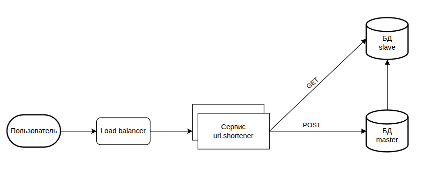

# Сокращатель ссылок

## О проекте
Это сокращатель ссылок. Сервис принимает ссылку от пользователя и возвращает ему короткую сылку,
по которой пользователь может попасть на нужную страницу.

### Технологии
- Laravel
- Балансировщик нагрузки Nginx
- SQL Master Slave replication
- Docker

### Схема проекта

1. Пользователь делает запрос на сервер.
2. Существует несколько инстансов сервиса по созданию и получения ссылок.
Балансировщик нагрузки с помощью алгоритма Round Robin направляет запрос на один из инстансов.
3. Запросы на создание ссылок идут в Master БД, а запросы на чтение идут в Slave БД.

## Установка
CHANGE MASTER TO MASTER_HOST='mysql-master', MASTER_USER='root', MASTER_PASSWORD='password', MASTER_LOG_FILE='mysql-bin.000014', MASTER_LOG_POS=13054; START SLAVE;